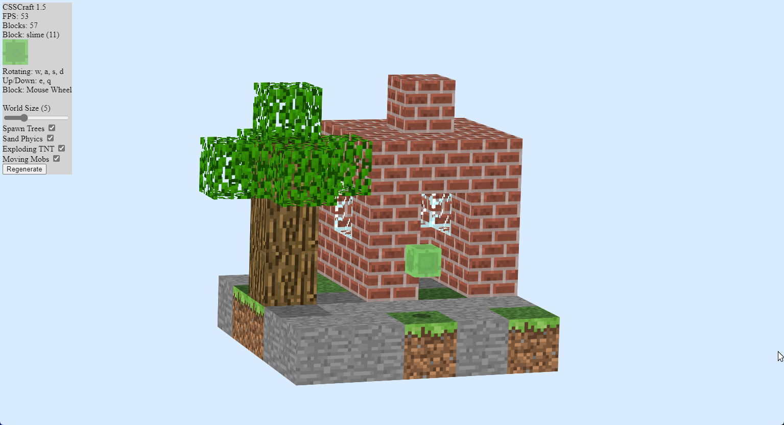

# CSSCraft
A game conceptually similar to Minecraft using exclusively CSS 3D transforms for rendering. Who needs Canvas or WebGL when every block can be made up of only six HTML elements all having to be translated to give an illusion of 3D? This project is very old and probably shouldn't exist,

## Features
- Pretty much 3D, I guess
- Sand physics
- Exploding TNT
- Slime mobs that jump around the map

## Try it out
Visit https://oskar2517.github.io/CSSCraft to run the game.